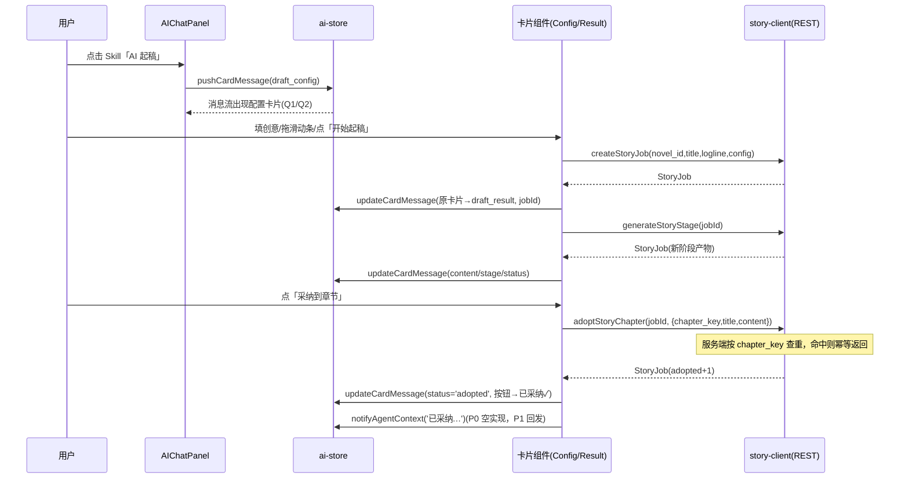

# AI 起稿对话范式 — 架构与任务分解

> 作者：高见远（架构师）
> 日期：2026-09-01
> 上游文档：`docs/plan/AI起稿对话范式-PRD.md`（范围权威，Q1–Q6 已拍板取推荐值）
> 状态：待评审

---

## 1. 方案总览

本方案是"范式迁移"而非重写：后端 story_jobs 状态机零改动，仅对 `AdoptChapter` 做一处幂等修复；前端在现有消息模型（`AIMessage`）上加可选 `card` 字段承载判别联合 `AgentCard`，点击 story skill 由 `AIChatPanel.invokeSkill` 确定性插入一张 assistant 侧配置卡片，确认后前端直调现有 story-client 端点创建 job 并把同一张卡片**原地替换**为结果卡片（Q6），此后所有按钮操作（生成下一阶段 / 采纳 / 重新生成 / 放弃）都通过 ai-store 的 `updateCardMessage` 在原消息上就地更新状态。卡片组件自持加载态，**不复用** story-store 的全局 `generating/adopting` 单例 flag，保证与旧面板双入口（Q3）互不阻塞。



---

## 2. 数据结构与类型定义（全文）

### 2.1 `packages/web/src/types/ai.ts`（追加）

```ts
import type { StoryJobConfig, StoryStage, StoryStatus } from '@/services/story-client';

/** ── 消息卡片机制（P0-1）──────────────────────────────────────────
 * 判别联合：以 kind 区分卡片种类，后续 polish/outline 卡片加新分支即可。
 * 卡片状态与操作结果全部存在消息数组内（内存态，本期不持久化）。
 */
export type AgentCard = DraftConfigCard | DraftResultCard;

/** 起稿配置卡片（Q1：点 skill 即插入；Q6：确认后原地替换为 DraftResultCard） */
export interface DraftConfigCard {
  kind: 'draft_config';
  /** editing: 可编辑；submitted: 已提交（瞬间态，随即被替换为结果卡） */
  status: 'editing' | 'submitted';
  novelId: number;
  /** 作品名（createStoryJob.title） */
  title: string;
  /** 一句话创意（createStoryJob.logline） */
  logline: string;
  /** 生成设置，滑动条规格与旧面板一致：3–50 默认 10 / 500–5000 step100 默认 2000 */
  config: StoryJobConfig;
}

/** 起稿结果卡片（P0-4 / P0-6 状态机） */
export interface DraftResultCard {
  kind: 'draft_result';
  jobId: number;
  novelId: number;
  /** job 标题（回显 createStoryJob.title） */
  title: string;
  /** running: 提交中/生成中；ready: 有产物可看；
   *  adopted: 当前章节已采纳；abandoned: 已放弃（灰化终态）；
   *  failed: 失败占位态（重试 P1-3） */
  status: 'running' | 'ready' | 'adopted' | 'abandoned' | 'failed';
  /** 当前流水线阶段（badge 展示） */
  stage: StoryStage;
  /** 当前阶段产物正文（stage_payload.content；verify 阶段为空则只展示报告摘要） */
  content?: string;
  /** 采纳成功后记录的章节 key（「已采纳 ✓」disabled 依据 + 幂等重试用） */
  adoptedKey?: string;
  /** job 状态快照（failed/paused 分支渲染用） */
  jobStatus?: StoryStatus;
  /** 失败摘要 */
  error?: string;
}
```

> 说明：`AIMessage` 位于 `types/ai.ts` L6-13（`types/index.ts` L11-19 仅 re-export），在其上追加一个可选字段：

```ts
export interface AIMessage {
  id: string;
  role: 'user' | 'assistant' | 'system';
  content: string;
  timestamp: Date;
  /** 创作 Agent 执行过的工具（展示在消息下方） */
  toolExecutions?: { tool: string; label: string }[];
  /** 消息卡片（Q2：渲染在 assistant 消息侧；带 card 的消息 content 可为引导文案） */
  card?: AgentCard;
}
```

### 2.2 ai-store 新增 action 签名（`stores/ai-store.ts`）

```ts
/** 在消息流末尾插入一条 assistant 侧卡片消息，返回消息 id（供后续原地更新） */
pushCardMessage: (card: AgentCard) => string;

/** Q6 原地替换/更新：按消息 id 定位，用 updater 产出新 card（类型按 kind 收窄在调用侧保证） */
updateCardMessage: (messageId: string, updater: (card: AgentCard) => AgentCard) => void;

/** Q5/P1-2 预留位：卡片操作成功后回发轻量上下文。P0 为 no-op，P1 改为 sendMessage(text) */
notifyAgentContext: (text: string) => void;
```

### 2.3 卡片组件 Props

```ts
// components/ai/cards/DraftConfigCard.tsx
interface DraftConfigCardProps {
  messageId: string;      // 用于 updateCardMessage 原地替换
  card: DraftConfigCard;
}

// components/ai/cards/DraftResultCard.tsx
interface DraftResultCardProps {
  messageId: string;
  card: DraftResultCard;
}

// components/ai/cards/CardShell.tsx（两卡共用的外壳：标题栏 + 状态 badge + 暗色容器）
interface CardShellProps {
  title: string;
  icon: ReactNode;
  badge?: { text: string; tone: 'violet' | 'green' | 'red' | 'gray' };
  children: ReactNode;
}
```

### 2.4 `chat-skills.tsx` 扩展

```ts
export interface ChatSkill {
  id: string;
  label: string;
  description: string;
  icon: ReactNode;
  prompt: string;
  /** 带 card 标记的 skill：invokeSkill 走插卡分支，不再挂输入框 chip */
  card?: 'draft_config';
}
```

---

## 3. 文件清单

### 3.1 新增文件

| 路径 | 职责 |
|------|------|
| `packages/web/src/components/ai/cards/CardShell.tsx` | 卡片共用外壳：标题栏（icon+标题+badge）、暗色容器（对齐旧面板 `bg-white/4 border-white/8 rounded-xl` token）、底部按钮槽位。约 60 行。 |
| `packages/web/src/components/ai/cards/DraftConfigCard.tsx` | 配置卡片：作品名 input、创意 textarea、章节数滑动条（3–50 默认 10）、每章字数滑动条（500–5000 step 100 默认 2000）、文风 input、auto_settle checkbox、开始起稿按钮。确认后直调 `createStoryJob`，成功即 `updateCardMessage` 原地替换为 `DraftResultCard` 并继续 `generateStoryStage`。本地 useState 管理提交中，创意为空时按钮 disabled。约 180 行。 |
| `packages/web/src/components/ai/cards/DraftResultCard.tsx` | 结果卡片：阶段徽章（`STORY_STAGE_LABELS`）+ job 状态 badge + 内容预览（默认折叠，可展开）+ 按钮组（生成下一阶段 / 采纳到章节 / 重新生成 / 放弃，按 `stage`/`status` 条件渲染）+ running spinner / failed 占位态。四个按钮分别调 `generateStoryStage` / `adoptStoryChapter` / `generateStoryStage` / `deleteStoryJob`，每次成功后 `updateCardMessage` 原地更新，并调用 `notifyAgentContext`（P0 空实现）。本地 useState 管理每个按钮的 loading。约 220 行。 |

### 3.2 修改文件

| 路径 | 锚点 | 改什么 |
|------|------|--------|
| `packages/web/src/types/ai.ts` | L6-13 `AIMessage`；文件末尾 | 加 `card?: AgentCard`；追加 §2.1 的 `AgentCard` 判别联合全文。 |
| `packages/web/src/types/index.ts` | L11-19 ai 类型 re-export 块 | 追加导出 `AgentCard, DraftConfigCard, DraftResultCard`。 |
| `packages/web/src/stores/ai-store.ts` | L14-53 `AIStore` 接口；实现体内（`sendMessage` L68-127 之后的空位） | 加 §2.2 三个 action。`pushCardMessage`：push `{id: crypto.randomUUID(), role:'assistant', content: 引导文案, timestamp, card}`；`updateCardMessage`：`messages.map` 命中 id 后替换 `card` 字段；`notifyAgentContext`：`return;`（P0 no-op，留 TODO 注释指向 P1-2）。**不**动 `sendMessage`。 |
| `packages/web/src/components/ai/chat-skills.tsx` | L14-21 `ChatSkill` 接口；L24-30 story 项 | 接口加 `card?: 'draft_config'`；story 项加 `card: 'draft_config'`。 |
| `packages/web/src/components/ai/AIChatPanel.tsx` | L61-64 `invokeSkill` | 分支：`if (skill.card === 'draft_config') { pushCardMessage({...默认参数, novelId: currentNovelId}); setSkillMenuOpen(false); return; }`（不 `setActiveSkill`，不挂 chip）。`handleSend` L111-127 与输入区 L221-350 不动。 |
| `packages/web/src/components/ai/MessageBubble.tsx` | L15-21 气泡容器 | 开头分支：`if (message.card) return <CardMessage message={message}/>`——外层保留现有 `justify-start` + 暗色气泡布局，内部按 `card.kind` 渲染对应卡片组件；`toolExecutions` 徽章逻辑保留。user 消息路径零改动。 |
| `packages/server/internal/dto/story_dto.go` | `AdoptChapterRequest` | `ChapterKey` 的 `binding:"required"` 去掉（改为可选，空值由服务端生成）；`Title`/`Content` binding 不变。 |
| `packages/server/internal/service/story_service.go` | L217-270 `AdoptChapter` | §4 幂等修复，唯一后端逻辑改动。 |

### 3.3 明确不改

- `components/story/StoryWorkflowPanel.tsx`（Q3 双入口保留）
- `services/story-client.ts`、`services/agent-chat-client.ts`（端点契约不变）
- `stores/story-store.ts`（其 `generating/adopting` 全局 flag L10-11 仍归旧面板；卡片路径不触达）
- `internal/service/agent_service.go`（Agent 循环本期不改；**预留**：未来在 `toolSchema()` L72-165 增加第 9 个工具 `start_story_draft`，`executeTool()` L305-449 加分支返回 `{job_id, stage}`，前端 agent 回包带 `card` 字段时复用现有 `updateCardMessage` 链路渲染卡片——仅此一段预留，不做实现）

---

## 4. 后端 AdoptChapter 幂等修复（精确方案）

### 4.1 现状问题（已核对 `story_service.go` L217-270）

1. 无条件 `CreateChapter` → 同一 chapter_key 重复采纳会建出重复章节并 `ChapterKeys++`；
2. 前端旧面板拼 `ch-${chapter_keys+1}`（`StoryWorkflowPanel.tsx` handleAdopt），双重提交/竞态下 key 相互碰撞；
3. `GetByID` → `CreateChapter` → `Update` 是无锁读改写，并发请求可交错。

### 4.2 改法（函数内重构，签名与路由不动）

```go
func (s *StoryService) AdoptChapter(ctx, userID, id, req) (*dto.StoryJobResponse, error) {
    s.lockJob(id)          // 新增：per-job 互斥，见 4.3
    defer s.unlockJob(id)

    job, err := s.repo.GetByID(ctx, userID, id)   // 原有
    // ① 解析 payload["adopted"] —— 从函数末尾上移到创建章节之前
    adopted := parseAdopted(job.StagePayload)     // 抽出既有 L237-246 解析逻辑为小函数

    // ② key 归一化：空 key 由服务端生成 ch-{ChapterKeys+1}
    key := req.ChapterKey
    if key == "" {
        key = fmt.Sprintf("ch-%d", job.ChapterKeys+1)
    }

    // ③ 幂等命中：key 已存在 → 不建章、不计数，返回现有 job（200）
    for _, m := range adopted {
        if m["chapter_key"] == key {
            return s.toResponse(job), nil
        }
    }

    // ④ 正常路径：CreateChapter → append {chapter_key: key, ...} → ChapterKeys++ → settle → Update
    //    （现有 L223-269 主体不变，append 时用归一化后的 key）
}
```

### 4.3 边界与并发

| 边界 | 处理 |
|------|------|
| 重复 key（重试/双击/旧面板重放） | ③ 幂等返回现有 job，HTTP 200，无新章节。符合 PRD P0-5「忽略重复采纳」。 |
| 空 key | ② 服务端生成 `ch-{ChapterKeys+1}`；因生成发生在互斥区内且生成后即查重，空 key 请求彼此不会撞 key。 |
| 并发 | 在 `StoryService` 增加轻量 per-job 锁：`mu sync.Mutex` + `map[int64]*sync.Mutex`（惰性创建，带一张 `map` 自身的锁，或用 `sync.Map`）。单实例部署下可彻底串行化同一 job 的 read-modify-write；多实例属未来引入分布式锁的范畴，超出本期（记录在风险）。 |
| 语义保持 | 不同 key 的两次采纳（含同 title 新内容）仍然建新章——重新生成后再采纳的语义不变（历史版本靠章节列表回看，PRD Q6 注）。 |
| 失败路径 | `CreateChapter` 失败时未进入 ③ 之后的写路径，job 无副作用，天然可重试。 |
| 旧面板兼容 | 旧面板始终传显式 key，重复点击旧面板按钮现在也是幂等的——行为只变好不变坏。 |

### 4.4 验收用例

1. 同一 `{job_id, chapter_key}` 连续 POST 两次 → 第二次 200 且章节列表无新增、`chapter_keys` 不变；
2. `chapter_key: ""` POST → 成功，返回 job 的 adopted 末条 key 形如 `ch-{N+1}`；
3. 两个并发空 key 请求 → 生成 `ch-{N+1}` / `ch-{N+2}` 两个不同 key，各自成章（语义正确，非重复）；
4. 旧面板既有流程回归不受影响。

---

## 5. 任务列表（按实现顺序，可直接派工）

| # | 任务 | 改动文件 | 依赖 | 验收标准 |
|---|------|----------|------|----------|
| T1 | AdoptChapter 幂等修复 | `server/internal/service/story_service.go`、`server/internal/dto/story_dto.go` | 无 | §4.4 四条用例通过；`go build ./...` 与现有测试通过；路由/状态机/端点零改动 |
| T2 | 前端卡片类型定义 | `types/ai.ts`、`types/index.ts` | 无 | §2.1 类型全文落地；`tsc --noEmit` 通过；现有代码不因 `AIMessage.card` 报错（可选字段） |
| T3 | ai-store 卡片 actions | `stores/ai-store.ts` | T2 | `pushCardMessage` 返回 id 且消息出现在数组尾；`updateCardMessage` 只改目标消息的 card；`notifyAgentContext` 为 no-op；`sendMessage` 行为不变 |
| T4 | skill 卡片标记 | `chat-skills.tsx` | T2 | story 项带 `card: 'draft_config'`；其余 5 个 skill 不带；`tsc` 通过 |
| T5 | invokeSkill 插卡分支 | `AIChatPanel.tsx` | T3, T4 | 点 story skill：消息流出现配置卡片、输入框不挂 chip；点其余 skill 行为与现状一致 |
| T6 | MessageBubble 卡片分支 | `MessageBubble.tsx` | T2 | 带 card 的 assistant 消息渲染卡片容器；无 card 的 user/assistant 消息渲染与现状逐像素一致 |
| T7 | DraftConfigCard 组件 | `components/ai/cards/CardShell.tsx`、`DraftConfigCard.tsx` | T3, T5 | 滑动条范围/默认值 = 旧面板（3–50 默认 10；500–5000 step100 默认 2000）；创意为空按钮 disabled；确认后成功创建 job 且原卡片变为结果卡片；创建失败卡片保留 editing 态并可重试 |
| T8 | DraftResultCard 组件 | `components/ai/cards/DraftResultCard.tsx` | T3, T7 | 四按钮按 stage/status 条件渲染；每次操作后卡片原地更新（不追加新消息）；采纳成功后按钮变「已采纳 ✓」disabled；重复点击不产生重复章节（配合 T1）；放弃后卡片灰化全按钮禁用 |
| T9 | 端到端联调验收 | 无新改动 | T1, T8 | PRD §1.3 三条定性验收全过：对话窗内完成起稿+采纳全程不开右栏面板；滑动条参数一致；重复采纳幂等。另回归旧面板全流程正常 |

关键路径：T1 ∥ (T2 → T3/T4 → T5/T6 → T7 → T8) → T9。前端链路 T2–T8 与后端 T1 完全并行。

---

## 6. 风险与待明确事项

1. **novel_id 来源**：配置卡片创建 job 需要 `novel_id`，取 `useNovelStore.currentNovel?.id`。**未选中作品时**「开始起稿」置灰并提示"请先在左栏选择/创建作品"，还是允许卡片内自动建书（调 agent 工具或 novels API）？建议 P0 用前者（与 agent 路径 `novelId ?? 0` 的现状一致），自动建书留待明确。
2. **空 key 的重试窗口**：服务端幂等以 chapter_key 为键。前端采纳成功后会把 `adoptedKey` 写回卡片并禁用按钮；但在"请求已发出、响应未返回"的窗口内断网重试会拿到新 key 建新章。P0 靠按钮 loading 态防护即可；若要协议级强幂等，P1 可引入 content 指纹或客户端生成的 uuid key（接口无需再改，只要前端传显式 key）。
3. **多实例部署**：per-job 互斥仅单实例有效；当前 InkBloom 单实例部署成立，若未来横向扩展需改 DB 唯一约束或分布式锁（记录，不阻塞本期）。
4. **verify 阶段无 content**：结果卡在 verify 阶段展示一致性报告摘要（issue_count）而非正文，采纳按钮隐藏；需在 T8 验收里覆盖。
5. **generate 是同步长请求**：结果卡「生成下一阶段」会等待整个 LLM 调用，需给出明确的按钮 loading 与超时提示；轮询刷新（P1-1）本期不做，P0 结果卡在生成完成后由响应直接更新，用户切换面板再回来不自动刷新（内存态 + 手动重进对话不恢复，属 PRD 已知的非目标）。
6. **Q5 预留接口**：`notifyAgentContext` P0 为空实现，所有卡片操作点都调用它，保证 P1 接 `sendMessage` 时只改一处。
