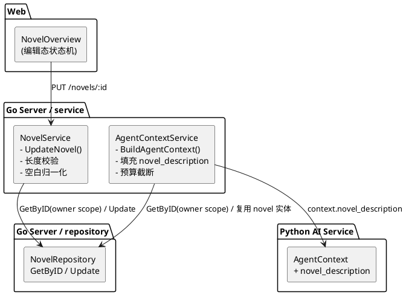
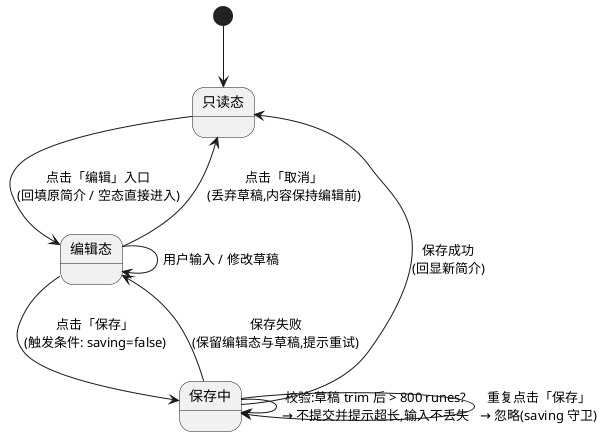
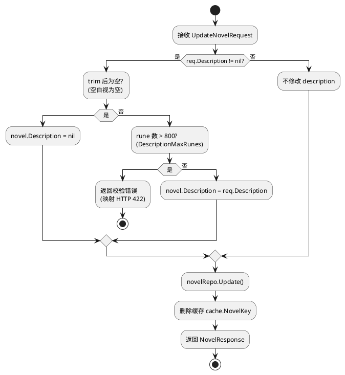
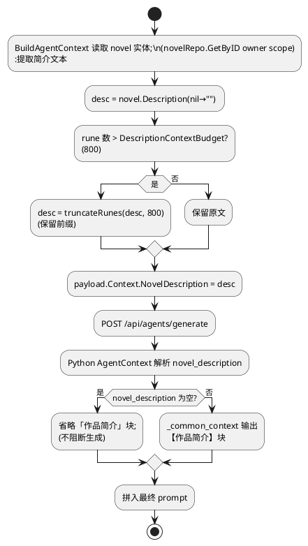
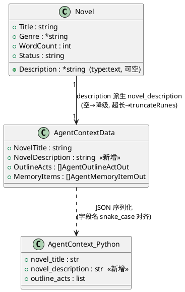

# 一、需求与存量功能关系分析

## 1.1 需求功能与存量功能对比

本需求的核心是将"作品简介"从一处**只读展示**升级为**可编辑的创作元信息**，并将其**同时对接给创作 Agent 上下文集装**。下面按"已实现 / 需扩展 / 需新增"三档梳理存量代码与需求的匹配关系。

### 1.1.1 已实现功能

| 需求功能 | 存量功能 | 代码位置 | 匹配度 |
|---------|---------|---------|--------|
| 简介持久化到 `novel.description` | `model.Novel.Description *string` 字段已存在，`type:text` | `packages/server/internal/model/novel.go:16` | 100% |
| 简介更新接口 `PUT /novels/:id` | handler → service → repo 三级链路已实现，路由已注册 | `packages/server/internal/handler/novel_handler.go:72-96`；`packages/server/internal/server/http.go:437`；`packages/server/internal/service/novel_service.go:107-139` | 100% |
| 简介更新入参/出参 DTO | `UpdateNovelRequest.Description *string`、`NovelResponse.Description string` 已定义 | `packages/server/internal/dto/novel_dto.go:13-20, 27` | 100% |
| 编辑权限隔离（仅所有者可写） | `UpdateNovel` 通过 `GetByID(ctx, userID, id)`（`scope.ForUser`）做所有权校验，非所有者返回 `ErrNotFound` | `packages/server/internal/repository/novel_repo.go:37-49`；`novel_service.go:108-115` | 100% |
| 前端简介更新动作 | `useNovelStore.updateNovel(id, data)` 已封装 `PUT /novels/:id`，并同步 `novels` 与 `currentNovel` | `packages/web/src/stores/novel-store.ts:91-97` | 100% |
| 前端简介类型定义 | `UpdateNovelRequest.description?: string` 已存在 | `packages/web/src/types/api.ts:20-25` | 100% |
| 作品概览页（首页简介板）已存在 | `NovelOverview` 组件已承载标题/简介/元信息展示 | `packages/web/src/components/editor/NovelOverview.tsx:1-135` | 100% |

### 1.1.2 需要扩展的功能

| 需求功能 | 存量功能 | 差异说明 | 扩展方向 |
|---------|---------|---------|---------|
| 简介编辑（进入编辑/回填/保存/取消/空态编辑） | `NovelOverview` 简介板块仅只读 `<p>` 展示（77-84 行），无编辑交互 | ① 无编辑入口与编辑态；② 无输入框回填与取消逻辑；③ 无空态编辑路径；④ 无保存中的防重复提交状态 | 在 `NovelOverview` 内新增本地编辑态，复用 `useNovelStore.updateNovel`，新增长度校验（≤800 字符）与空白归一化，编辑态用受控 `<textarea>` 承接 |
| 简介长度校验与空白归一化（后端防线） | `UpdateNovel` 仅做指针赋值 `novel.Description = req.Description`（123-125 行），无长度与空白校验 | ① 无描述长度上限校验；② 无"仅空白视为空"归一化；③ 非法输入缺少独立错误码 | `NovelService.UpdateNovel` 增加 description 校验：trim 后为空→存 `nil`；rune 数超限→返回校验错误；新增长度常量与错误映射 |
| Agent 上下文携带简介 | `AgentContextData` 仅含 `NovelTitle`，无简介字段；`BuildAgentContext` 已取到 `novel` 但未输出 `description` | ① 上下文输出缺 `novel_description` 字段；② 无空简介降级与超长截断预算 | Go 端 `AgentContextData` 增加 `NovelDescription` 字段并在组装时填充；Python 端同步增加字段与格式化 |

### 1.1.3 需要新增的功能或接口

按业务模块分组：

**A. 概览页简介编辑（前端，`NovelOverview.tsx`）**
1. **编辑态切换**：简介板块只读态新增"编辑"入口，点击进入编辑态；取消/保存后回到只读态。
   - 输入：用户点击编辑入口 / 点击取消 / 点击保存；输出：组件本地状态 `editing: boolean` 与 `draft: string` 的流转。
   - 依赖：无新增后端接口，复用 `useNovelStore.updateNovel`。
2. **长度校验提示**：前端在提交前校验 800 字符（rune）上限，超限不提交并提示，输入内容不丢失。
3. **保存防重复提交**：保存进行中忽略再次点击（`saving: boolean` 守卫）。
4. **空白视为空**：`draft.trim()` 为空时提交空值，展示空态提示。

**B. 简介长度校验与归一化（后端，`NovelService.UpdateNovel`）**
1. **描述长度上限**：以常量约束简介不超过 800 个 Unicode 字符（rune），与发布态 `synopsis` 上限保持一致。
   - 输入：`req.Description *string`；输出：校验通过/失败；失败映射为 HTTP 422 + 独立错误信息。
2. **空白归一化**：`description` trim 后为空则写为 `nil`（等价空简介）。

**C. 创作 Agent 上下文携带简介（Go 后端 + Python AI 服务）**
1. **Go 端上下文字段**：`AgentContextData` 新增 `NovelDescription string`（json `novel_description`）。
   - 输入：`BuildAgentContext` 已取得的 `novel *model.Novel`；输出：填充到 `payload.Context.NovelDescription`。
   - 空简介降级：`nil`/空字符串输出为空字符串（下游省略）。
   - 超长截断：以预算常量约束（如 800 rune）调用既有 `truncateRunes` 截断。
2. **Python 端上下文字段**：`AgentContext` 新增 `novel_description: str = ""`，`_common_context` 新增"作品简介"块格式化。
   - 依赖：`packages/ai-service/app/agents/models.py`、`packages/ai-service/app/agents/scenes.py`。

## 1.2 存量功能详细分析

### 1.2.1 简介更新链路（Go 后端）

**接口契约**
- `PUT /api/v1/novels/:id`，请求体 `UpdateNovelRequest`（字段均为可空指针，语义为"仅更新非 nil 字段"），响应 `NovelResponse`。
- 入参：`{ title?, genre?, description?, cover_image?, status? }`；出参：更新后的作品元信息；异常：非法 id→400，非所有者/不存在→404，其它→422。
- 副作用：更新后删除缓存 `cache.NovelKey`（`novel_service.go:137`），保证列表/详情读取一致。

**业务规则**
- 所有权隔离依赖 `GetByID` 的 `scope.ForUser(userID)`，非所有者等价于"不存在"，天然阻断越权写（`novel_repo.go:37-49`）。
- `Update` 在 repo 层强制 `novel.UserID = userID`（`novel_repo.go:69-76`），防止 `user_id` 被重指派。

**扩展点**
- 目前 `UpdateNovel` 尚无针对 `description` 的字段级校验，是本次校验逻辑的挂载点。
- `toNovelResponse`（`novel_service.go:171-190`）已正确处理 `Description` 指针→字符串的转换，无需改动。

**约束**
- 更新链路是同步单请求，无事务要求（单表 update），但需保证缓存失效在更新成功后执行（现状已满足）。
- 简介为纯文本语义，不应破坏既有 `description` 读取逻辑（发布、导出、列表均复用该字段）。

### 1.2.2 Agent 上下文组装（Go 后端）

**接口契约**
- `AgentContextService.BuildAgentContext(ctx, userID, novelID int64, scene string, itemID, nodeID *string, instruction string) (*AgentGeneratePayload, error)`。
- 出参 `AgentGeneratePayload{ Scene, Instruction, Context: AgentContextData }`，`AgentContextData` 字段与 Python 契约字段名严格一一对应（snake_case）。
- 被三处调用：对话式写作 `agent_service.go:500`、全本起稿 `story_service.go:213`、通用生成 `ai_handler.go:908`，均传入 `userID`+`novelID`，天然满足"按 novel_id 隔离、不跨作品泄漏"。

**业务规则**
- 组装过程已读取 `novel`（`agent_context.go:159`），当前仅取 `novel.Title` 写入 `NovelTitle`；新增简介只需在同一处追加字段。
- 各上下文片段（大纲/记忆/前文/知识图谱/伏笔）均有独立的 `loadXxx` 方法 + 空值降级 + 上限截断策略（如 `precedingChapterBudget=4000`、knowledge 上限 50、foreshadow 上限 30），简介字段应沿用同一种"降级 + 预算截断"范式。

**扩展点**
- `AgentContextData`（`agent_context.go:61-75`）与 Python `AgentContext`（`models.py:42-55`）是字段同步的两端，新增字段必须在两端同命名。

**约束**
- 契约字段名冻结（别名禁止），新增字段名固定为 `novel_description`。
- 组装耗时增量需 < 50ms（DFX 4.1.2），简介读取复用已取到的 `novel` 即可，无需额外查询，天然满足。

### 1.2.3 概览页简介展示（前端）

**现状**
- `NovelOverview` 简介板块仅以 `<p>` 只读渲染 `currentNovel.description`，空值为硬编码提示文案（77-84 行）。
- 组件通过 `useNovelStore` 读取 `currentNovel`，`updateNovel` 已存在于 store，编辑保存无需新增网络请求。

**约束**
- 组件为纯函数式 React 组件，编辑态需引入本地 `useState`（`editing`/`draft`/`saving`），不涉及全局状态污染。
- 长度上限需与后端常量一致（800 字符），避免前后端判定漂移；提示文案需覆盖"超长不丢失"与"保存失败可重试"两类异常。

# 二、增量设计方案

## 2.1 实现模型

### 2.1.1 上下文视图

本组件横跨前端（web）、后端（Go server）、AI 服务（Python）三层。上下文视图仅展示模块间接口与协议，不展开内部结构。

```plantuml
@startuml
skinparam componentStyle rectangle

package "Web (React)" {
  [NovelOverview\n概览页简介板] as Overview
  [useNovelStore\nupdateNovel()] as Store
}

package "Go Server" {
  [NovelHandler] as Handler
  [NovelService\nUpdateNovel()] as Service
  [AgentContextService\nBuildAgentContext()] as AgentCtx
}

package "Python AI Service" {
  [AgentContext\n(Pydantic)] as PyCtx
  [scenes._common_context()] as PyScene
}

Overview --> Store : 调用 updateNovel(id, {description})
Store --> Handler : PUT /api/v1/novels/:id\n(HTTP/JSON)
Handler --> Service : UpdateNovel(ctx,userID,id,req)
Service --> Service : 校验长度/归一化空白\n写 novels.description

overview_note : 编辑成功后仅刷新前端本地状态，\n简介持久化已由 PUT 完成

AgentCtx --> PyCtx : POST /api/agents/generate\ncontext.novel_description\n(HTTP/JSON, snake_case)
PyCtx --> PyScene : 格式化「作品简介」块
PyScene --> PyCtx : 注入 prompt
@enduml
```

**通讯说明**
- `PUT /api/v1/novels/:id`：前端 → 后端，同步请求，频率低（用户手动保存）。
- `POST /api/agents/generate`：后端 → AI 服务，同步请求，频率随创作请求触发，简介字段为上下文子字段，复用现有契约通道，无新增端点。

### 2.1.2 服务/组件总体架构



**职责划分**
- `NovelOverview`：简介的只读/编辑状态机与前端校验，不直接触碰网络（通过 store）。
- `NovelService.UpdateNovel`：简介写入口，负责后端长度校验与空白归一化，写库后失效缓存。
- `AgentContextService.BuildAgentContext`：简介上下文的读取与截断式填充，复用已加载的 `novel` 实体，无额外查询。
- `AgentContext`（Python）：承接 `novel_description` 字段并格式化为 prompt 片段。

**配置项与取值策略**
- 简介长度上限常量 `DescriptionMaxRunes = 800`（与 `synopsis` 上限一致），前后端共用同一数值，避免判定漂移。
- Agent 上下文简介预算常量 `DescriptionContextBudget = 800`（rune），防御存量超长数据，超出按前缀截断。

### 2.1.3 实现设计文档

#### 2.1.3.1 简介编辑状态机（前端 `NovelOverview`）



**关键分支说明**
- 进入编辑：`draft = currentNovel.description ?? ''`；空白简介等价于空态编辑。
- 保存前置校验：`[...draft].length > 800` 时拒绝提交，展示"简介超出 800 字限制"提示，草稿保留。
- 提交：`draft.trim()` 为空则提交空字符串（后端归一化为 `nil`）；否则提交原文。
- 保存成功：`updateNovel` 回写 `currentNovel`，组件切回只读态；保存失败：切回编辑态，保留草稿，展示后端错误。

#### 2.1.3.2 简介长度校验与归一化（后端 `NovelService.UpdateNovel`）



**分支与策略**
- 仅当 `req.Description != nil` 时才处理，保持"仅更新非 nil 字段"的既有语义。
- 校验错误通过新增的服务层错误（如 `ErrDescriptionTooLong`）返回，由 handler 映射为 422，信息文案拼入错误码/`Message`。

#### 2.1.3.3 Agent 上下文简介填充（后端 `BuildAgentContext` + Python 格式化）



**分支与策略**
- 空简介降级：空字符串不生成简介块，生成流程不中断（满足 DFX 4.2.2 与 5.2.1 规则3）。
- 超长截断：沿用既有 `truncateRunes`（`agent_context.go:372`），保留可读前缀。
- 即时生效：每次组装都从 `novel` 实体读取 `Description`，自然使用最新保存值（编辑后无需额外失效逻辑）。

## 2.2 接口设计

### 2.2.1 总体设计

接口变更遵循"最小侵入"原则：不新增 HTTP 端点，仅在既有契约上增加字段与校验。所有改动点均保持类型安全（Go 端结构体字段、Python Pydantic 字段、TS 接口）。

| 接口 | 变更类型 | 说明 | 稳定性 |
|------|---------|------|--------|
| `PUT /api/v1/novels/:id` | 增强 | 新增 `description` 长度校验与空白归一化，请求体结构不变 | 稳定 |
| `UpdateNovelRequest`（DTO） | 不变 | `description *string` 已存在，无需改动 | 稳定 |
| `AgentContextData`（Go） | 新增字段 | 增加 `NovelDescription string`（json `novel_description`），向后兼容（缺省为空） | 稳定 |
| `AgentContext`（Python Pydantic） | 新增字段 | 增加 `novel_description: str = ""`，带默认值，向后兼容 | 稳定 |
| `UpdateNovelRequest`（TS） | 不变 | `description?: string` 已存在 | 稳定 |

**接口变更策略**
- 所有新增字段均带默认值/可空语义，旧客户端（不传 `novel_description`）与旧 AI 服务（不识别 `novel_description`）不受影响。
- 字段命名与既有契约一致，采用 `snake_case`：`novel_description`。
- 无接口版本升级需求，不引入破坏性变更。

### 2.2.2 接口清单

#### 2.2.2.1 简介更新（后端校验增强）

**接口签名**

```go
// dto.UpdateNovelRequest —— 无需改动，description 字段已存在
type UpdateNovelRequest struct {
    Title       *string `json:"title,omitempty"`
    Genre       *string `json:"genre,omitempty"`
    Description *string `json:"description,omitempty"` // 受限于 800 rune，空白归一化为 nil
    CoverImage  *string `json:"cover_image,omitempty"`
    Status      *string `json:"status,omitempty"`
}

// service 层新增错误
var ErrDescriptionTooLong = errors.New("description exceeds 800 characters")
```

**业务说明**：创作者保存简介时，后端对 `description` 做规范：空白→`nil`；超 800 rune→拒绝。
**前置条件**：调用者已通过权限中间件，`userID` 为作品所有者（由 `GetByID` scope 校验）。
**后置条件**：成功后 `novels.description` 更新，缓存 `cache.NovelKey` 被删除。
**异常映射**：`description` 超限 → HTTP 422 + `ErrDescriptionTooLong` 文案；非所有者/不存在 → HTTP 404 `novel not found`。
**调用示例**：

```json
PUT /api/v1/novels/12
{ "description": "一名落魄剑客在乱世中重拾剑心，护一方周全。" }
```

#### 2.2.2.2 Agent 上下文简介字段（Go 端）

**接口签名**

```go
// AgentContextData 增加字段（既有字段保持不变）
type AgentContextData struct {
    NovelTitle        string                `json:"novel_title"`
    NovelDescription  string                `json:"novel_description"` // 新增：当前作品简介，空为降级
    OutlineActs       []AgentOutlineActOut  `json:"outline_acts"`
    PrecedingChapters []AgentChapterExcerpt `json:"preceding_chapters"`
    MemoryItems       []AgentMemoryItemOut  `json:"memory_items"`
    TargetItem        json.RawMessage       `json:"target_item"`
    TargetNode        json.RawMessage       `json:"target_node"`
    KnowledgeNodes    []AgentKnowledgeNodeOut `json:"knowledge_nodes"`
    ForeshadowThreads []AgentForeshadowOut  `json:"foreshadow_threads"`
}
```

**业务说明**：`BuildAgentContext` 在读取 `novel` 后，从 `novel.Description` 派生 `novel_description`，经 `truncateRunes(desc, DescriptionContextBudget)` 约束后写入 payload。
**前置条件**：`novelRepo.GetByID` 返回非 nil 的 `novel`（不存在则返回 `ErrNotFound`）。
**后置条件**：`payload.Context.NovelDescription` 为当前作品简介（可能为空字符串）。
**异常映射**：`description` 为 `nil` → 输出空字符串（降级，不报错）。
**调用示例**（上下文 JSON 片段）：

```json
{ "scene": "chapter", "instruction": "...", "context": { "novel_title": "剑心", "novel_description": "一名落魄剑客……", "outline_acts": [] } }
```

#### 2.2.2.3 Agent 上下文简介字段（Python 端）

**接口签名**

```python
class AgentContext(BaseModel):
    novel_title: str = ""
    novel_description: str = ""   # 新增，缺省空字符串，与 Go 契约对齐(snake_case)
    outline_acts: list[OutlineAct] = []
    preceding_chapters: list[ChapterExcerpt] = []
    memory_items: list[MemoryItemCtx] = []
    target_item: dict | None = Field(default=None)
    target_node: dict | None = Field(default=None)
    knowledge_nodes: list[dict] = []
    foreshadow_threads: list[dict] = []
```

**业务说明**：`scenes._common_context` 在"作品"块之后追加"作品简介"块；空字符串时省略该块。
**前置条件**：`AgentContext` 反序列化成功。
**后置条件**：最终 prompt 视简介有无包含"作品简介"片段。
**异常映射**：字段缺失 → Pydantic 以默认空字符串承接（向后兼容）。
**调用示例**（`_common_context` 追加逻辑）：

```text
【作品】
书名：《剑心》
【作品简介】
一名落魄剑客在乱世中重拾剑心，护一方周全。
```

## 2.3 数据模型

### 2.3.1 设计目标

1. **业务场景**：简介作为创作元信息，需支持前端编辑持久化，并作为创作 Agent 上下文的一部分参与生成。
2. **兼容性**：沿用既有 `novels.description`（`type:text`）字段，不新增存储字段、不改动既有读取逻辑（发布、导出、列表复用同一字段）。
3. **约束对齐**：简介长度上限统一为 800 个 Unicode 字符（rune），与发布态 `synopsis` 上限一致；存量超长/空简介数据向后兼容（读取不报错，Agent 侧按预算截断）。

> **需求一致性说明**：需求规格 `5.1.1` 规则 6 描述简介上限为"2000 字符"，与 `6.1` 数据约束"不超过 800 字符（与 synopsis 一致）"相冲突。本设计以数据约束章节的 800 字符为准（因明确与发布态 synopsis 对齐，且属最终强约束），并建议需求方将 `5.1.1` 规则 6 统一为 800；若不接受，可将常量调整为 2000，其余设计不变。

### 2.3.2 模型实现



**对象关系说明**
- `Novel.Description` 是简介的唯一持久化事实来源；`AgentContextData.NovelDescription` 为其派生值，非独立存储对象。
- 依赖方向：`Novel` → `AgentContextData` → `AgentContext_Python`，单一数据流，无反向依赖。

**对象创建/销毁策略**
- `AgentContextData`/`AgentContext_Python` 为请求级对象，随每次 `BuildAgentContext` 调用创建、随响应结束销毁，无跨请求状态。
- `Novel.Description` 生命周期由其所属 `Novel` 实体决定，编辑保存即原地更新，删除作品时随级联删除。

**持久化策略（不含表结构）**
- 简介仍写入 `novels.description`（`type:text`），由 `NovelRepository.Update` 落库，无迁移、无新表。
- 长度约束与空白归一化在 `NovelService.UpdateNovel` 写入前置完成，数据库层面不做额外约束（避免破坏存量数据导入）。