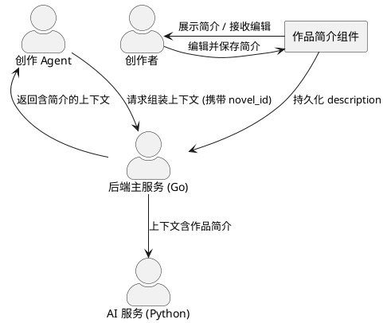
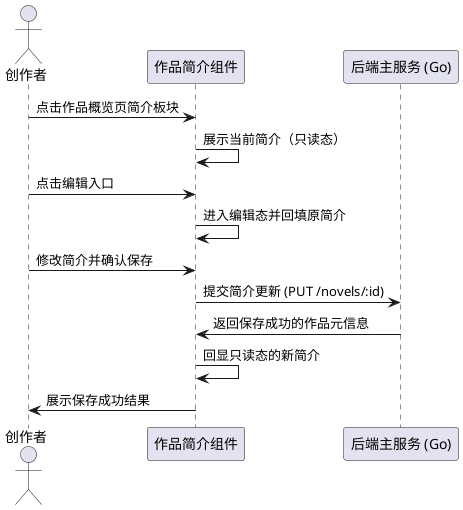
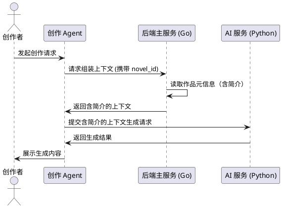

# **1. 组件定位**

## **1.1 核心职责**
本组件负责作品简介的展示、编辑与创作 Agent 上下文对接，实现简介成为可维护、可协作的创作元信息。

## **1.2 核心输入**
1. 用户选中作品的操作指令：创作者在作品列表点击作品后，触发概览页加载并展示该作品简介。
2. 用户提交的简介编辑内容：创作者在简介板块编辑并确认后的新简介文本。简介需要「AI 自动生成/润色」入口。
3. 创作 Agent 的调用请求：创作者发起对话式创作或全本起稿时，Agent 请求携带作品编号用于组装上下文。

## **1.3 核心输出**
1. 展示给用户的当前作品简介：概览页简介板块呈现的作品简介内容（含空态提示）。
2. 持久化的作品简介：写入作品元信息（`novel.description`），供作品列表、发布、导出等场景复用。
3. 携带作品简介的 Agent 上下文：创作 Agent 组装上下文时输出的、包含作品简介的上下文数据结构，交由 AI 服务完成生成。

## **1.4 职责边界**
1. 不负责简介的 AI 自动生成、润色或改写——该能力归属创作 Agent，本组件仅负责展示、人工编辑与上下文传递。
2. 不负责作品标题、题材、封面、状态等其他元信息的编辑。
3. 不负责发布态 `synopsis` 与作品简介之间的数据联动逻辑（发布流程单独维护发布快照）。
4. 不负责章节、大纲、记忆、伏笔等其他创作对象的编辑与上下文组装（各自已有独立能力）。

# **2. 领域术语**

**作品简介**
: 对作品主题、主线、卖点的概括性描述，是作品元信息的一部分，同时作为创作 Agent 理解作品、保持创作方向一致的依据。

**作品概览页**
: 创作者选中作品后中央编辑区展示的作品级信息页，承载作品简介、字数、章节数等元信息与新建章节、删除作品等操作入口。
: 备注：前端对应组件 `NovelOverview`，即需求语境中的"首页简介板"。

**创作 Agent**
: InkBloom 的对话式创作助手与全本起稿助手，通过工具调用与上下文组装完成创作任务。
: 备注：包含对话式 Agent（`/agent/chat`）与全本起稿 Agent（story jobs），二者共用上下文组装服务。

# **3. 角色与边界**

## **3.1 核心角色**
- 创作者：查看作品简介；编辑并保存作品简介；发起创作 Agent 请求。

## **3.2 外部系统**
- 后端主服务（Go）：持久化作品元信息；接收简介更新请求；组装并输出创作 Agent 上下文。
- AI 服务（Python）：消费携带作品简介的上下文数据，完成内容生成。

## **3.3 交互上下文**

# **4. DFX约束**

## **4.1 性能**
1. 简介保存请求的服务端响应时间应当小于 1000ms。
2. 将简介纳入 Agent 上下文组装，单次组装耗时增量应当小于 50ms。

## **4.2 可靠性**
1. 简介保存失败时，用户已填写的简介内容不丢失，用户可重试保存。
2. Agent 上下文组装遇到作品简介字段缺失时，应当降级为空值继续生成，不阻断生成流程。

## **4.3 安全性**
1. 仅作品所有者可编辑该作品的简介，非所有者不得修改。
2. 简介内容纳入 Agent 上下文仅限当前作品（按 `novel_id` 隔离），不跨作品泄漏。

## **4.4 可维护性**
1. 简介保存与 Agent 上下文组装应记录结构化日志，包含作品编号与操作结果。
2. 简介纳入 Agent 上下文后，该字段变更应可被监控与回溯。

## **4.5 兼容性**
1. 简介为纯文本，沿用现有 `description` 字段语义，不新增存储字段、不改动既有读取逻辑。
2. 空简介与超长简介场景应对存量数据向后兼容。

# **5. 核心能力**

## **5.1 简介编辑**

### **5.1.1 业务规则**

1. **进入编辑**：the 作品简介模块 shall 在概览页简介板块提供进入编辑状态的入口。
   a. 验收条件：When 创作者点击简介板块的编辑入口 → the 作品简介模块 shall 将简介由只读展示切换为可编辑输入态。

2. **编辑展示**：the 作品简介模块 shall 在编辑态回填当前简介原文，并允许创作者修改。
   a. 验收条件：When 作品已有简介且进入编辑态 → the 作品简介模块 shall 在输入框内展示原简介全文供修改。

3. **空态编辑**：the 作品简介模块 shall 在作品无简介时可直接进入编辑态。
   a. 验收条件：When 作品简介为空且创作者点击编辑入口 → the 作品简介模块 shall 展示空输入框供填写。

4. **保存**：the 作品简介模块 shall 在创作者确认保存后，将新简介持久化到该作品。
   a. 验收条件：When 创作者在编辑态确认保存 → the 作品简介模块 shall 保存简介并回显为只读展示态的新内容。

5. **取消/放弃编辑**：the 作品简介模块 shall 支持取消编辑并放弃未保存的修改。
   a. 验收条件：When 创作者在编辑态取消 → the 作品简介模块 shall 回到只读展示态且内容保持编辑前状态。

6. **长度校验**：the 作品简介模块 shall 限制简介长度不超过 2000 字符。
   a. 验收条件：When 创作者提交超过 2000 字符的简介 → the 作品简介模块 shall 拒绝保存并提示超长，输入内容不丢失。

7. **空白处理**：the 作品简介模块 shall 将仅含空白的简介视为空简介。
   a. 验收条件：When 创作者提交空白简介 → the 作品简介模块 shall 将简介保存为空值并展示空态提示。

8. **禁止项**：the 作品简介模块 shall 禁止在保存未完成时重复提交。
   a. 验收条件：If 上一次保存在进行中 → the 作品简介模块 shall 忽略重复的保存操作，避免并发写入。

### **5.1.2 交互流程**

### **5.1.3 异常场景**

1. **保存失败**
   a. 触发条件：后端服务不可用或网络异常导致简介更新请求失败。
   b. 系统行为：the 作品简介模块 shall 保留编辑态与已填写的简介内容，允许创作者重试。
   c. 用户感知：提示"简介保存失败，请重试"，输入内容不丢失。

2. **后端校验失败**
   a. 触发条件：后端拒绝此次简介更新（如权限不足或字段非法）。
   b. 系统行为：the 作品简介模块 shall 不覆盖本地已填写内容，并回显失败原因。
   c. 用户感知：展示后端返回的错误提示（如"无权限修改该作品"）。

## **5.2 简介对接给创作 Agent**

### **5.2.1 业务规则**

1. **上下文携带简介**：the 创作 Agent 上下文服务 shall 在组装创作上下文时携带当前作品简介。
   a. 验收条件：When 创作 Agent 请求组装某作品的上下文 → the 创作 Agent 上下文服务 shall 在上下文数据中返回该作品的简介字段。

2. **标题与简介一并提供**：the 创作 Agent 上下文服务 shall 同时提供作品标题与作品简介，使生成内容与作品定位一致。
   a. 验收条件：When 上下文组装且作品存在简介 → the 创作 Agent 上下文服务 shall 同时输出作品标题与简介。

3. **空简介降级**：the 创作 Agent 上下文服务 shall 在作品无简介时降级为不携带简介而不阻断生成。
   a. 验收条件：When 作品简介为空 → the 创作 Agent 上下文服务 shall 输出空简介（或省略该字段）并继续完成生成。

4. **超长简介处理**：the 创作 Agent 上下文服务 shall 对纳入上下文的简介长度进行预算约束，超出时按预算截断。
   a. 验收条件：When 简介长度超出上下文预算 → the 创作 Agent 上下文服务 shall 截断至预算内并保留可读前缀。

5. **编辑后即时生效**：the 创作 Agent 上下文服务 shall 在后续每次上下文组装时读取最新简介。
   a. 验收条件：When 创作者已保存新简介并再次发起 Agent 请求 → the 创作 Agent 上下文服务 shall 使用最新保存的简介。

6. **禁止项**：the 创作 Agent 上下文服务 shall 禁止跨作品引入其他作品的简介。
   a. 验收条件：If Agent 请求指定作品 → the 创作 Agent 上下文服务 shall 仅携带该作品自身的简介。

### **5.2.2 交互流程**

### **5.2.3 异常场景**

1. **简介读取失败**
   a. 触发条件：组装上下文时作品简介读取异常（如作品刚被删除）。
   b. 系统行为：the 创作 Agent 上下文服务 shall 降级为空简介并继续组装其他上下文片段。
   c. 用户感知：生成流程不中断，内容基于其余上下文产出。

2. **超长简介截断**
   a. 触发条件：简介长度超过上下文单字段预算。
   b. 系统行为：the 创作 Agent 上下文服务 shall 按预算截断简介，保留开头核心内容。
   c. 用户感知：生成内容仍可基于简介主干，不报错。

# **6. 数据约束**

## **6.1 作品简介（description）**
1. **内容**：纯文本，支持多行，用于概括作品主题、主线、卖点。
2. **必填性**：可空；空值表示"暂无简介"。
3. **长度**：不超过 800 字符（与发布态 `synopsis` 长度上限保持一致）。synopsis 长度上限也800.
4. **编辑权限**：仅作品所有者可读写。
5. **一致性**：作为创作 Agent 上下文的简介输入，须与当前作品的 `description` 保持一致（读取最新值）。